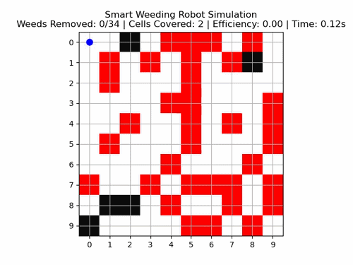

# 🌾 Smart Autonomous Paddy Weeding Robot Simulation

AI-based autonomous agricultural robot simulation achieving intelligent weed detection and efficient field coverage using probability mapping and adaptive traversal.

🚀 Built using Python, NumPy & Matplotlib | AI-based Simulation Project

## 📌 Project Overview

This project simulates an AI-driven agricultural weeding robot using Python.  
The system models a 2D field environment where a robot autonomously detects and removes weeds while avoiding obstacles.

The simulation includes:

- 🚜 Zig-zag tractor-style traversal  
- 🌾 AI-based weed probability heatmap  
- ⚫ Obstacle detection  
- 📊 Real-time efficiency metrics  
- 🎥 Animated visualization  
- 💾 MP4 export using FFmpeg  

---

## 🚀 Features

- AI-based Weed Probability Mapping  
- Zig-zag Field Coverage Algorithm  
- Obstacle Detection and Avoidance  
- Visual Weed Removal State Transition  
- Live Performance Metrics (Efficiency, Coverage, Timer)  
- Animation Export as MP4  

---

## 🧠 Algorithm Design

### 1️⃣ Weed Prediction Model
A probability heatmap simulates AI-based weed density prediction.

### 2️⃣ Traversal Strategy
The robot follows a zig-zag tractor-style movement pattern to ensure full field coverage efficiently.

### 3️⃣ Obstacle Handling
Cells marked as obstacles are skipped during traversal.

### 4️⃣ Efficiency Calculation

Efficiency = Weeds Removed / Cells Covered

---

## 🛠 Tech Stack

- Python  
- NumPy  
- Matplotlib  
- FFmpeg  

---

## 🎬 Sample Output

📷 Screenshot:

[

### 🎥 Video Demo
[▶ Download simulation video](https://github.com/pidishettysandhya1/automatic-weeding-system/raw/refs/heads/main/smart_weeding_robot.mp4)

---

## 📂 Project Structure
automatic-weeding-system/
│
├── paddy_weeding_system.py      # Main simulation code
├── smart_weeding_robot.mp4     # Simulation video output
├── Screenshot 2026-02-15 154906.png   # Simulation screenshot
├── README.md                   # Project documentation
